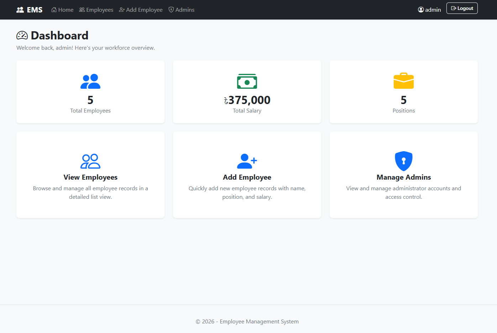
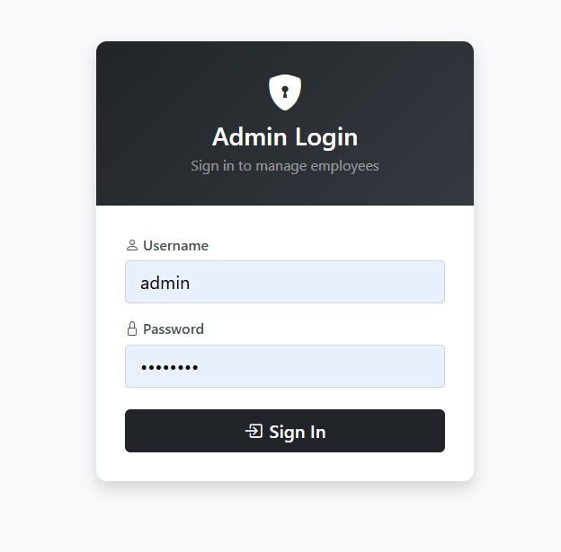
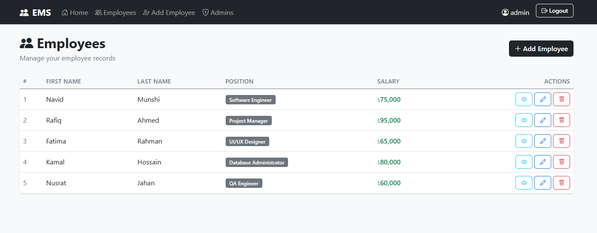
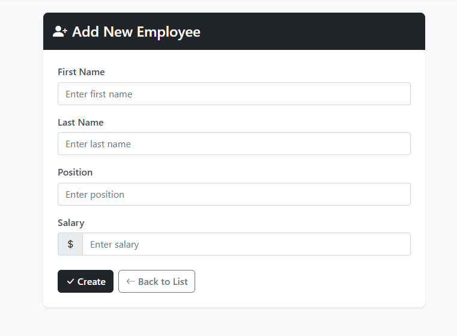
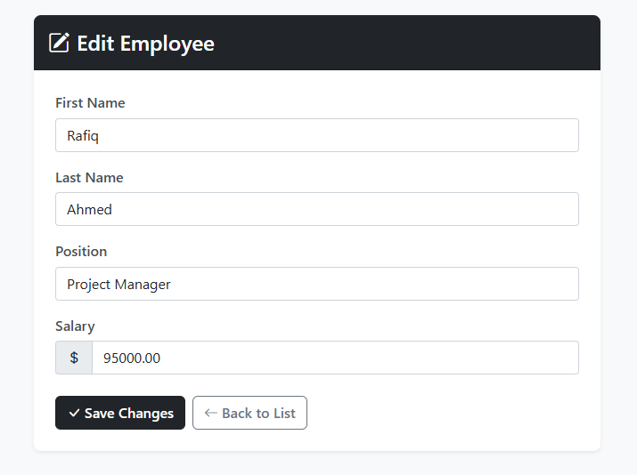
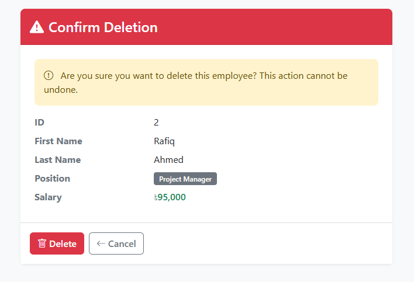

# Employee Management System (ASP.NET Core MVC)

A clean and professional ASP.NET Core MVC application for managing employee records with admin authentication.

## Screenshots

| Home Page | Login Page |
|:-:|:-:|
|  |  |

| Employee List | Create Employee |
|:-:|:-:|
|  |  |

| Edit Employee | Delete Confirmation |
|:-:|:-:|
|  |  |

## Features

- **Employee CRUD Operations** — Create, Read, Update, and Delete employee records
- **Admin Authentication** — Secure login using cookie-based authentication
- **Authorization** — Only authenticated admins can access employee management features
- **Validation** — Server-side and client-side validation using Data Annotations
- **Responsive UI** — Built with Bootstrap 5 for a clean, modern interface

## Tech Stack

- **Framework:** ASP.NET Core MVC (.NET 8)
- **ORM:** Entity Framework Core 8
- **Database:** SQL Server (LocalDB)
- **Frontend:** Razor Views, Bootstrap 5, Bootstrap Icons
- **Authentication:** Cookie Authentication

## Prerequisites

- [.NET 8 SDK](https://dotnet.microsoft.com/download/dotnet/8.0)
- [SQL Server LocalDB](https://docs.microsoft.com/en-us/sql/database-engine/configure-windows/sql-server-express-localdb) (included with Visual Studio)
- Visual Studio 2022 or VS Code

## Getting Started

### 1. Clone the Repository

```bash
git clone https://github.com/your-username/EmployeeManagementMVC.git
cd EmployeeManagementMVC
```

### 2. Update Connection String (if needed)

The default connection string in `appsettings.json` uses LocalDB:

```json
"ConnectionStrings": {
    "DefaultConnection": "Server=(localdb)\\mssqllocaldb;Database=EmployeeManagementDB;Trusted_Connection=True;MultipleActiveResultSets=true"
}
```

Update this if you are using a different SQL Server instance.

### 3. Apply Database Migrations

```bash
dotnet ef database update
```

### 4. Run the Application

```bash
dotnet run
```

The application will be available at `https://localhost:5001` or `http://localhost:5000`.

## Default Admin Credentials

| Username  | Password     | Email                |
|-----------|--------------|----------------------|
| `admin`   | `admin123`   | `admin@company.com`  |
| `manager` | `manager123` | `manager@company.com`|

> **Note:** These credentials are seeded automatically when the database is created.

## Sample Employee Data

The following employees are seeded for demonstration:

| Name            | Position               | Salary     |
|-----------------|------------------------|------------|
| Navid Munshi    | Software Engineer      | ৳75,000    |
| Rafiq Ahmed     | Project Manager        | ৳95,000    |
| Fatima Rahman   | UI/UX Designer         | ৳65,000    |
| Kamal Hossain   | Database Administrator | ৳80,000    |
| Nusrat Jahan    | QA Engineer            | ৳60,000    |

## Project Structure

```
EmployeeManagementMVC/
├── Controllers/
│   ├── HomeController.cs          # Home page
│   ├── EmployeeController.cs      # Employee CRUD operations
│   ├── AdminController.cs         # Admin CRUD operations
│   └── AccountController.cs       # Login/Logout authentication
├── Data/
│   └── AppDbContext.cs            # Entity Framework DbContext
├── Models/
│   ├── Employee.cs                # Employee entity model
│   ├── Admin.cs                   # Admin entity model
│   └── ErrorViewModel.cs         # Error view model
├── ViewModels/
│   └── LoginViewModel.cs         # Login form view model
├── Views/
│   ├── Home/
│   │   └── Index.cshtml           # Home page
│   ├── Employee/
│   │   ├── Index.cshtml           # Employee list
│   │   ├── Create.cshtml          # Create employee form
│   │   ├── Edit.cshtml            # Edit employee form
│   │   ├── Details.cshtml         # Employee details
│   │   └── Delete.cshtml          # Delete confirmation
│   ├── Admin/
│   │   ├── Index.cshtml           # Admin list
│   │   ├── Create.cshtml          # Create admin form
│   │   ├── Edit.cshtml            # Edit admin form
│   │   ├── Details.cshtml         # Admin details
│   │   └── Delete.cshtml          # Delete confirmation
│   ├── Account/
│   │   ├── Login.cshtml           # Login page
│   │   └── AccessDenied.cshtml    # Access denied page
│   └── Shared/
│       ├── _Layout.cshtml         # Main layout
│       └── _ValidationScriptsPartial.cshtml
├── wwwroot/
│   └── css/
│       └── site.css               # Custom styles
├── Program.cs                     # Application entry point
├── appsettings.json               # Configuration
└── README.md
```

## Database Schema

### Employee Table

| Column    | Type           | Constraints                |
|-----------|----------------|----------------------------|
| Id        | int            | Primary Key, Identity      |
| FirstName | nvarchar(100)  | Required                   |
| LastName  | nvarchar(100)  | Required                   |
| Position  | nvarchar(100)  | Required                   |
| Salary    | decimal(18,2)  | Required, Must be > 0      |

### Admin Table

| Column   | Type          | Constraints                  |
|----------|---------------|------------------------------|
| AdminId  | int           | Primary Key, Identity        |
| Username | nvarchar(100) | Required                     |
| Password | nvarchar(100) | Required                     |
| Email    | nvarchar(100) | Required, Valid email format  |

## License

This project is for demonstration purposes.
